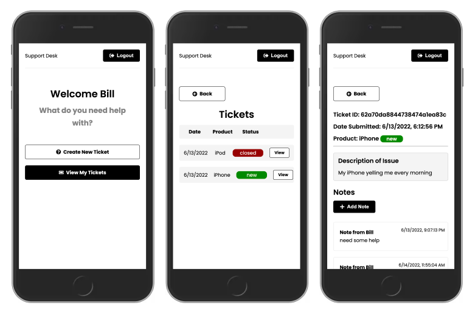

# Support Desk

React app as Support desk and Ticketing system with MERN Stack



## Usage

Add your MONGO_URI to .env

### Install dependencies

```
# Backend deps
npm install

# Frontend deps
cd frontend
npm install
```

### Run Server

I am not sure how long this will be up tho

dassistance.herokuapp.com/
